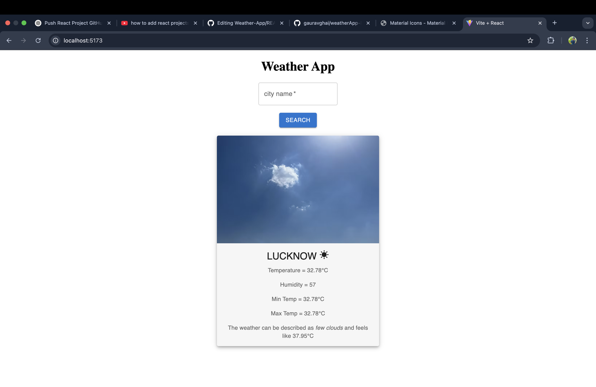

# 🌤️ Weather App

A simple and responsive weather application built using **React.js** and the **OpenWeatherMap API**. This app displays real-time weather details like temperature, humidity, weather condition, and more for any city entered by the user.

## 🚀 Features

- 🔍 Search for any city
- 🌡️ Display current temperature, min/max temperature, humidity
- ☁️ Weather description and "feels like" data
- 🏙️ Preloaded default city (**Lucknow**) with sample weather data on initial load
- 💻 Responsive design using React and Material UI
- ⚠️ Error handling for invalid locations

## 🛠️ Tech Stack

- **Frontend**: React.js, HTML, CSS, JavaScript
- **API**: [OpenWeatherMap API](https://openweathermap.org/api)
- **UI Components & Icons**: [Material UI](https://mui.com/) for form input, buttons, icons, and cards

🔗 **Live Demo:** [Click here to view the app](https://weather-app-two-xi-64.vercel.app/)

--

## 📸 Preview

--

